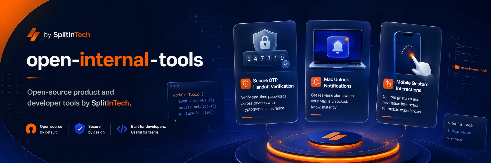

<p align="center">
  
</p>

<h1 align="center">Open Internal Tools</h1>

<p align="center">
  <a href="https://github.com/splitintech/open-internal-tools/blob/main/LICENSE"></a>
  <a href="https://github.com/splitintech/open-internal-tools/stargazers"></a>
  <a href="https://github.com/splitintech/open-internal-tools/graphs/contributors"></a>
  <a href="https://github.com/splitintech/open-internal-tools/issues"></a>
</p>

<p align="center">
  <a href="#getting-started">Docs</a>
  ·
  <a href="#contributing">Community</a>
  ·
  <a href="#projects">Projects</a>
  ·
  <a href="https://www.splitin.net/tech-stack">Tech stack</a>
  ·
  <a href="https://www.splitin.net/careers-requests">Careers</a>
</p>

<p align="center">
  <a href="https://www.splitin.net/tech-stack/open-internal-tools">www.splitin.net/tech-stack/open-internal-tools</a>
</p>

<p align="center">
  
</p>

# Open internal tools is how SplitIn lets open source build the **tech side** of small-community little-capitalist products

We let open source build the tech side of the small community little capitalists projects. Maintainers would be confident independent contributors who would love to build the tech for the projects end to end.

We bring open source contributors here to **build and lead end-to-end developer tools**. Projects are **built internally first**, then **open sourced as packages** others can use. A package can **stay open source** and later also ship as a **hosted proprietary SplitIn product**. Think of FFmpeg if it were a little capitalist: a serious end-to-end tool, owned by people who ship it, that makes **end consumers' lives easier** — not a weekend gist.

This repository is MIT open source. Every new folder is the tech part of a product — not a random gist. SplitIn the company lives at [splitin.net](https://www.splitin.net).

- **Internal, then packages**: we build in-house, then publish packages so others can use the same tool.
- **Stay open, host later**: a project can remain MIT and, when it earns it, also become a hosted SplitIn product. Every contributor would have **% equity** in that hosted service.
- **Version by version**: every project keeps improving release by release, with out-of-the-box applications.
- **Best possible condition**: every project uses technological advancements to break the barriers of software development — faster, smaller, more beautiful, cheaper, better UX, monetized when it can be, digitized when it can be, time-saving, integrated even if only a few developers need it.
- **Tools that support tools**: we build as many internal supporting tools as other projects need.
- **Domain and tool specialists**: each specialist maintains everything for that tool or domain end to end.
- **People and agents, in sync**: every contributor works with other contributors **and** agents synchronously.
- **Break the barriers of software development**: every contributor tasks themselves to make every tool **faster**, **smoother**, and **easier for the user** — **low latency**, **high fidelity**, **least compute**, **least memory**.
- **[mac-unlock-notify](mac-unlock-notify/)**: Slack your phone when this Mac is unlocked.
- **[slack-agent-hq](slack-agent-hq/)**: Slack project-thread router plus taggable Cursor, Claude, Codex, ChatGPT, and specialist bots.
- **[ideation-loop-system](ideation-loop-system/)**: `#ideate` LOOP — ChatGPT PLAN → Codex PRD → Cursor/xAI/Codex 5.6 sol → Claude UI, one Slack thread, MEMORY.md + logs.
- **[in-app-otp](in-app-otp/)**: `@splitin/in-app-otp` — in-app OTP handoff for marketplace verification.
- **[react-mobile-interactions](react-mobile-interactions/)**: `@splitin/react-mobile-interactions` — swipe, back layers, and native-feeling mobile motion.
- **[vscode-agent-router](vscode-agent-router/)**: Cursor / VS Code dispatcher to Claude, Codex, Slack, and catalog peers over MCP, CLI, or API.
- **Careers**: SplitIn tech careers live at [splitin.net/careers-requests](https://www.splitin.net/careers-requests).
- **Engineering**: [Mission, vision, values, and the full stack](https://www.splitin.net/tech-stack) — Tech 51%, business 50%; 45% R&D back to open source.

## Table of contents

- [Mission](#open-internal-tools-is-how-splitin-lets-open-source-build-the-tech-side-of-small-community-little-capitalist-products)
- [Engineering mission and vision](#engineering-mission-and-vision)
- [How projects work](#how-projects-work)
- [Best possible condition](#best-possible-condition)
- [Who we want](#who-we-want)
- [Tech stack](#tech-stack)
- [Getting started](#getting-started)
- [Projects](#projects)
- [Contributing](#contributing)
- [Open source](#open-source-vs-splitin-product)
- [We're seeking individual contributors](#were-seeking-individual-contributors)

## Engineering mission and vision

This is the same engineering copy as [splitin.net/tech-stack](https://www.splitin.net/tech-stack). Housing mission lives on [About](https://www.splitin.net/about). Engineering is here.

**Mission.** We build the tech stack behind the SplitIn closed-source and open-source projects. Individual contributors own folders end to end. We invest **45% as R&D** back to the open-source tools SplitIn uses, plus tech projects that digitize traditional businesses, current business-domain agent integrations, and technology open-source works — to build a future of prosperity. We build communities, design communities, develop buildings, and design buildings.

**Vision.** **Tech 51%. Business 50.** Founders and cofounders of every project, and SplitIn LLC as the parent company, are shareholders. In the world of AI a computer can build many things if people and agents are orchestrated together like adults — for togetherness and prosperity. Everything is written down. You build the first MVP for the application we speak. The best is merged to the main repo with tests, trust-me-bro benchmarks, and live user tests. We build fast and then refine. Every contributor brings an acquaintance after building the building blocks of the architecture. Every project would be allotted funds.

**Values.**

- **45% R&D back to open source** — plus digitized businesses, agent integrations, and open-source work.
- **Communities and buildings** — build them, design them. That work is all the CTOs.
- **Founders, cofounders, and SplitIn LLC** are shareholders of every project.
- **Everyone is an individual contributor** — no spectator roles. Own a folder end to end, in sync with other contributors and agents.
- **Orchestrated like adults** — people and agents in the same loop.
- **Everything is written down** — process, decisions, and benchmarks live in the repo.
- **MVP, then merge** — tests, trust-me-bro benchmarks, and live user tests.
- **Build fast, then refine** — every contributor brings an acquaintance after building the building blocks of the architecture.
- **Every project is allotted funds.**
- **Right tool, indie-cheap, break the barriers** — and **% equity** in the hosted service when a line of work becomes a SplitIn product.

## How projects work

1. **Build internally.** A domain or tool specialist owns the work end to end inside SplitIn.
2. **Open source as a package.** Others can install and use it. It can stay MIT forever.
3. **Keep shipping versions.** Out-of-the-box applications improve release by release.
4. **Support other projects.** Spin up as many internal tools as sibling products need.
5. **Hosted product when it earns it.** The same line of work can later run as a proprietary SplitIn hosted service. Every contributor would have **% equity** in that hosted service.
6. **Work in sync.** Contributors coordinate with other contributors and with agents in the same thread of work — not in isolated handoffs.

## Best possible condition

Every project should be in its **best possible condition**. Contributors use technological advancements to **break the barriers of software development**.

- If it can get **fast**, make it fast.
- If it can get **smaller**, make it smaller.
- If it can be **designed beautifully**, design it beautifully.
- If it can **cost low**, make it cost low.
- If the **user experience** can get better, make it better.
- If it can be **monetized**, make it monetized.
- If it can be **digitized**, make it digitized.
- If it can **save time**, make it save time.
- If it can be **integrated**, build it.
- Even if **few developers** can use it, build it.

## Who we want

We are not looking for drive-by typo PRs as the main contribution. We want **contributors who build and lead end-to-end projects** and who already work the way this hub is built:

- You pick the **right tool and language for that job**, not one stack for every folder. Shell for a LaunchAgent. TypeScript for a Slack router. React for mobile motion. Python or SQL when the package needs it.
- You **pick and choose across open source** — Bolt, Slack CLI, vitest, tsup, existing MCP servers — instead of writing a platform from scratch.
- You keep **cost as low as an indie developer**: no extra cloud, no extra seats, no extra daemons unless the product requires them.
- You **use LLMs to write code** and you **ship fast**. Multiple agent workflows (Cursor, Claude, Codex, ChatGPT, and specialists in one thread) are how you scale, not a demo.
- You **can write without AI**. You use AI **delegation** to solve more problems in the same week, not to skip understanding the system.
- You are a **domain specialist** or **tool specialist** and you maintain everything for that domain or tool.
- You can take a product-tech folder from internal build → package → versioned out-of-the-box app.
- You own scope, architecture, docs, and release — the project CTO.
- You like FFmpeg-shaped work: one sharp tool, done properly, that consumers feel.
- You work **synchronously with other contributors and agents**, not as a solo silo.
- You task yourself to **break the barriers of software development**: faster, smoother, easy for the user, low latency, high fidelity, least compute, least memory.
- You are comfortable that the package might stay open source **and** later also become a hosted SplitIn product — and that every contributor would have **% equity** in that hosted service.
- You leave every project in its **best possible condition**: fast, small, beautiful, cheap, better UX, monetized when it can be, digitized when it can be, time-saving, integrated even if only a few developers need it.

If that is you, open an issue to propose a folder, or pick up [mac-unlock-notify](mac-unlock-notify/), [slack-agent-hq](slack-agent-hq/), [ideation-loop-system](ideation-loop-system/), [in-app-otp](in-app-otp/), [react-mobile-interactions](react-mobile-interactions/), or [vscode-agent-router](vscode-agent-router/) as maintainer.

## Tech stack

The public catalog is **[splitin.net/tech-stack](https://www.splitin.net/tech-stack)**. Folders here pick the right tool for that job.

Use what the folder already uses unless the job clearly needs something else. Current products:

| Folder | Language / runtime | Libraries and services |
| --- | --- | --- |
| [mac-unlock-notify](mac-unlock-notify/) | zsh on macOS | LaunchAgent, `ioreg`, `curl`, Slack incoming webhooks |
| [slack-agent-hq](slack-agent-hq/) | TypeScript on Node 20+ | Slack Bolt, Slack CLI, YAML config, SQLite (`node:sqlite`), vitest, tsx, npm workspaces |
| [ideation-loop-system](ideation-loop-system/) | TypeScript on Node 20+ | Same HQ router plus `#ideate` classifier, MEMORY.md, cost gates, specialist inner loops, `/loop` `/audit` `/done` |
| [in-app-otp](in-app-otp/) | TypeScript | tsup, vitest; adapters for React, Express, Django, Supabase |
| [react-mobile-interactions](react-mobile-interactions/) | TypeScript + React | vitest, tsup, mobile gesture / overlay primitives |
| [vscode-agent-router](vscode-agent-router/) | TypeScript on Node 20+ | Cursor/VS Code extension, MCP stdio, `tsup`, vitest, official Claude/Codex/Slack CLIs |

Shared defaults: MIT product folders, install from that folder only, secrets in `.env` / `~/.config` never in git, OSS first, indie-cheap to run. Slack-side coding agents are official apps (`@Cursor`, `@Claude`, `@Codex`, `@ChatGPT`) plus MCP/CLI/API rows in `integrations.yaml` — not a new custom bot per vendor.

## Getting started

Clone the program repo, then enter one product folder and follow **that** README.

```zsh
git clone https://github.com/splitintech/open-internal-tools.git
cd open-internal-tools/mac-unlock-notify
chmod +x install.sh uninstall.sh bin/mac-unlock-notify
./install.sh
```

`mac-unlock-notify` installs a macOS LaunchAgent. You will paste a Slack incoming webhook (never commit it). Full steps: [mac-unlock-notify/README.md](mac-unlock-notify/README.md).

Slack agent HQ is a separate product. Install it from its own folder:

```zsh
git clone https://github.com/splitintech/open-internal-tools.git
cd open-internal-tools/slack-agent-hq
chmod +x install.sh
./install.sh
```

Full steps: [slack-agent-hq/README.md](slack-agent-hq/README.md).

The `#ideate` LOOP is a separate product folder. Install it from **ideation-loop-system**:

```zsh
git clone https://github.com/splitintech/open-internal-tools.git
cd open-internal-tools/ideation-loop-system
chmod +x install.sh
./install.sh
```

Full steps: [ideation-loop-system/README.md](ideation-loop-system/README.md).

Packages live in their own folders too:

```zsh
cd open-internal-tools/in-app-otp
npm install && npm test
```

```zsh
cd open-internal-tools/react-mobile-interactions
npm install && npm test
```

Full steps: [in-app-otp/README.md](in-app-otp/README.md) and [react-mobile-interactions/README.md](react-mobile-interactions/README.md).

Agent Router is a Cursor / VS Code extension. Install it from its own folder:

```zsh
cd open-internal-tools/vscode-agent-router
npm install && npm test && npm run build
```

Full steps: [vscode-agent-router/README.md](vscode-agent-router/README.md).

## Projects

Each folder has a SplitIn URL that 301s to that GitHub tree: `https://www.splitin.net/tech-stack/open-internal-tools/{folder}`.

| Product | Tech folder | splitin.net | What it does | Maintainer |
| --- | --- | --- | --- | --- |
| Hub | [open-internal-tools](https://github.com/splitintech/open-internal-tools) | [tech-stack/open-internal-tools](https://www.splitin.net/tech-stack/open-internal-tools) | Program repo for product-tech folders | Open — independent contributor / project CTO |
| Mac unlock canary | [mac-unlock-notify](mac-unlock-notify/) | [tech-stack/open-internal-tools/mac-unlock-notify](https://www.splitin.net/tech-stack/open-internal-tools/mac-unlock-notify) | Notify Slack on iPhone when this Mac is unlocked | Open — independent contributor / project CTO |
| Slack agent HQ | [slack-agent-hq](slack-agent-hq/) | [tech-stack/open-internal-tools/slack-agent-hq](https://www.splitin.net/tech-stack/open-internal-tools/slack-agent-hq) | One Slack thread per project; taggable Cursor/Claude/Codex/ChatGPT plus specialist bots | Open — independent contributor / project CTO |
| Ideation loop system | [ideation-loop-system](ideation-loop-system/) | [tech-stack/open-internal-tools/ideation-loop-system](https://www.splitin.net/tech-stack/open-internal-tools/ideation-loop-system) | `#ideate` LOOP: ChatGPT → Codex → Cursor → Claude on one thread, with MEMORY.md, logs, and cost gates | Open — independent contributor / project CTO |
| In-app OTP | [in-app-otp](in-app-otp/) | [tech-stack/open-internal-tools/in-app-otp](https://www.splitin.net/tech-stack/open-internal-tools/in-app-otp) | Framework-neutral in-app OTP handoff for marketplace verification | Open — independent contributor / project CTO |
| React mobile interactions | [react-mobile-interactions](react-mobile-interactions/) | [tech-stack/open-internal-tools/react-mobile-interactions](https://www.splitin.net/tech-stack/open-internal-tools/react-mobile-interactions) | Swipe tabs, overlay back layers, and native-feeling mobile motion | Open — independent contributor / project CTO |
| Agent Router | [vscode-agent-router](vscode-agent-router/) | [tech-stack/open-internal-tools/vscode-agent-router](https://www.splitin.net/tech-stack/open-internal-tools/vscode-agent-router) | Route Cursor agents to Claude, Codex, Slack, and catalog peers over MCP, CLI, or API | Open — independent contributor / project CTO |

New products land as a new folder. That folder is the tech for that product.

## Contributing

We welcome contributions big and small:

- Open an issue or a product request.
- Send a pull request into **one** product folder.
- Work with other contributors **and** agents in the same loop — propose, review, and ship together.
- Task yourself to break the barriers of software development. Leave every project in its **best possible condition**: if it can get fast, make it fast; smaller, make it smaller; designed beautifully, design it beautifully; cost low, make it cost low; UX better, make it better; monetized, monetize it; digitized, digitize it; save time, save time; integrated, build it — even if few developers can use it.
- Every contributor would have **% equity** in the hosted service that product later provides.
- See [CONTRIBUTING.md](CONTRIBUTING.md) for secrets policy and the specialist model.

Do not commit webhooks, tokens, or local `~/.config` files.

## Open-source vs SplitIn product

Projects start **internal**, then go out as **open-source packages**. They keep improving **version by version**, including out-of-the-box apps and supporting tools for other projects. A package may **stay open source** and later also run as a **hosted proprietary SplitIn product**. Every contributor would have **% equity** in that hosted service. SplitIn the company is at [https://www.splitin.net](https://www.splitin.net). Listing here does not mean Slack Marketplace distribution.

## We're seeking individual contributors

Hey! If you're reading this, you've proven yourself as a dedicated README reader.

We are seeking **individual contributors** who pick the right tool for the job, compose open source instead of rebuilding it, keep cost indie-low, can write the code themselves, and use LLMs plus multi-agent workflows to ship more. Own a product's tech end to end. Every contributor would have **% equity** in the hosted service that product later provides.

Leave every project in its **best possible condition**. Break the barriers of software development: if it can get fast, make it fast; if it can get smaller, make it smaller; if it can be designed beautifully, design it beautifully; if it can cost low, make it cost low; if the user experience can get better, make it better; if it can be monetized, make it monetized; if it can be digitized, make it digitized; if it can save time, make it save time; if it can be integrated, build it — even if few developers can use it, build it.

Explore SplitIn tech careers at **[https://www.splitin.net/careers-requests](https://www.splitin.net/careers-requests)**. Engineering mission, vision, values, and the stack: **[https://www.splitin.net/tech-stack](https://www.splitin.net/tech-stack)**.

<p align="center">
  
</p>
