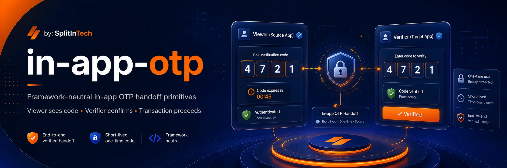

<p align="center">
  
</p>

<h1 align="center">@splitin/in-app-otp</h1>

<p align="center">
  <strong>In-app OTP handoff for marketplace verification flows.</strong>
</p>

<p align="center">
  <a href="https://github.com/splitintech/open-internal-tools/blob/main/in-app-otp/LICENSE"></a>
  <a href="https://www.npmjs.com/package/@splitin/in-app-otp"></a>
  <a href="https://github.com/splitintech/open-internal-tools/tree/main/in-app-otp"></a>
</p>

<p align="center">
  <a href="../README.md">Hub</a>
  ·
  <a href="#getting-started">Docs</a>
  ·
  <a href="#server-usage">Server</a>
  ·
  <a href="#use-cases">Use cases</a>
  ·
  <a href="#react-usage">React</a>
  ·
  <a href="https://www.splitin.net/careers-requests">Careers</a>
</p>

<p align="center">
  <a href="https://www.splitin.net/tech-stack/open-internal-tools/in-app-otp">www.splitin.net/tech-stack/open-internal-tools/in-app-otp</a>
</p>

<p align="center">
  
</p>

# One actor sees the code. Another must enter it. The sensitive step cannot continue until they do.

Framework-neutral primitives for when one authenticated **viewer** should see a 4-digit code in-app and an authenticated **verifier** must enter it before a tour, trip, booking, or order can proceed.

Built internally at SplitIn, open sourced as a **package** others can install. It can stay MIT and later also ship as a hosted SplitIn product. A domain specialist owns this folder end to end.

- **Viewer / verifier / subject / purpose**: explicit roles, not a generic SMS OTP.
- **Hash at rest**: the server stores `codeHash`; plaintext is ephemeral.
- **Out of the box**: React display + entry, REST, Express, Supabase, Django guidance.
- **Version by version**: keep shipping the package; supporting tools for sibling products as needed.

## Table of contents

- [Getting started](#getting-started)
- [Use cases](#use-cases)
- [Core concepts](#core-concepts)
- [Server usage](#server-usage)
- [React usage](#react-usage)
- [HTTP contract](#http-contract)
- [Supabase adapter](#supabase-adapter)
- [Django / Rickshaw](#django--rickshaw-guidance)
- [SplitIn live tours](#splitin-guidance)
- [Careers](#careers)

## Getting started

```bash
npm install @splitin/in-app-otp
```

From this hub:

```sh
git clone https://github.com/splitintech/open-internal-tools.git
cd open-internal-tools/in-app-otp
npm install
npm run build
npm test
```

Work in sync with other contributors and agents. PRs stay in `in-app-otp/`.

## Use cases

Ten ways developers integrate `@splitin/in-app-otp` so one authenticated actor sees a code and another must enter it:

1. **Live tour start** — renter is `viewer`, guide is `verifier`, `subjectType = tour_session`, `purpose = splitin.live_tour.start`.
2. **Trip / ride start** — passenger shows the code; driver enters it before `STARTED` (`purpose = rickshaw.trip.start`).
3. **Marketplace pickup** — buyer displays a 4-digit code; seller verifies before marking the order handed off.
4. **Key or lockbox exchange** — guest sees the code in-app; host or lock firmware is the verifier.
5. **In-person check-in** — venue staff enter the guest’s on-screen OTP before a booking becomes `checked_in`.
6. **Delivery without SMS** — recipient is viewer; courier is verifier; no carrier OTP, hash at rest only.
7. **Two-person payout / refund** — ops viewer shows a code; a second authenticated admin must enter it to release money.
8. **Device pairing** — phone shows the code; the other device or desktop session is the verifier.
9. **Desk or access claim** — member shows the code at a front desk; staff verify before granting a co-working seat.
10. **Destructive admin override** — staff OTP must be entered before delete, ban, or force-cancel; wire `OtpCodeDisplay` + `OtpEntryForm` and the REST routes.

## Core concepts

- `viewer`: the user who can see the OTP.
- `verifier`: the user who must enter the OTP.
- `subject`: the protected object, such as a `tour_session`, `trip`, `booking`, or `order`.
- `purpose`: the verification reason, such as `splitin.live_tour.start` or `rickshaw.trip.start`.

The package defaults to 4 numeric digits, a 5 minute TTL, and 5 attempts. The server stores only `codeHash`; plaintext OTPs are returned only as an ephemeral server result or through an explicitly configured ephemeral viewer-code store.

## Server usage

```ts
import {
  InMemoryOtpChallengeStore,
  compareOtpCode,
  createDefaultOtpAuthorization,
  createOtpChallenge,
  createSystemClock,
  generateNumericOtp,
  generateOtpId,
  hashOtpCode,
  verifyOtpChallenge,
} from "@splitin/in-app-otp/server";

const store = new InMemoryOtpChallengeStore({ retainPlainCodesForViewer: true });
const deps = {
  store,
  clock: createSystemClock(),
  generateCode: generateNumericOtp,
  generateId: generateOtpId,
  hashCode: (code: string) => hashOtpCode(code),
  compareCode: (code: string, hash: string) => compareOtpCode(code, hash),
  authorize: createDefaultOtpAuthorization(),
};

const created = await createOtpChallenge({
  actor: { id: "renter_1" },
  tenantId: "splitin",
  purpose: "splitin.live_tour.start",
  subjectType: "tour_session",
  subjectId: "tour_session_1",
  viewerUserId: "renter_1",
  verifierUserId: "guide_1",
}, deps);

await verifyOtpChallenge({
  actor: { id: "guide_1" },
  challengeId: created.challenge!.id,
  code: created.viewerCode!,
}, deps);
```

## React usage

```tsx
import { OtpCodeDisplay, OtpEntryForm, useOtpEntry } from "@splitin/in-app-otp/react";

function ViewerScreen({ code }: { code: string }) {
  return <OtpCodeDisplay code={code} digitClassName="otp-digit" />;
}

function VerifierScreen({ client, challengeId }: any) {
  const otp = useOtpEntry({ client, challengeId });
  return (
    <OtpEntryForm
      value={otp.value}
      onChange={otp.setValue}
      onSubmit={otp.verify}
      loading={otp.loading}
      error={otp.error?.message}
    />
  );
}
```

## HTTP contract

The optional REST adapter expects these routes:

- `POST /otp/challenges`
- `GET /otp/challenges/:id`
- `POST /otp/challenges/:id/verify`
- `POST /otp/challenges/:id/cancel`

Responses use:

```ts
type OtpHttpChallengeResponse = {
  ok: boolean;
  code: string;
  challenge?: OtpPublicChallenge;
  message?: string;
};
```

`codeHash` is never returned. Verifier responses never include the plaintext OTP.

## Supabase adapter

Use `SupabaseOtpChallengeStore` with a service-role Supabase client. The package exports `SUPABASE_IN_APP_OTP_MIGRATION_SQL` as a starting migration template.

Recommended RLS posture:

- users can read only challenges where they are `viewer_user_id` or `verifier_user_id`;
- only service role can create, verify, cancel, lock, or expire challenges;
- plaintext OTP is never stored in Postgres.

## Django / Rickshaw guidance

For Django, mirror the `in_app_otp_challenges` fields in a model and perform verification inside `transaction.atomic()` with `select_for_update()`. For Rickshaw trip start, the future integration point is `driver_trip_transition(..., action="start")`: verify `purpose = "rickshaw.trip.start"` for `subjectType = "trip"` before transitioning to `STARTED`.

## SplitIn guidance

For SplitIn live tours, the intended future integration is:

- `purpose = "splitin.live_tour.start"`
- `subjectType = "tour_session"`
- `subjectId = tour_sessions.id`
- `viewerUserId = renter_id`
- `verifierUserId = guide_id`

The guide initiates the live-tour start, the renter sees the OTP in-app, and the guide enters it before the tour can transition from `starting` to `live`.

## Careers

Own this package end to end — or explore SplitIn tech careers — at **[https://www.splitin.net/careers-requests](https://www.splitin.net/careers-requests)**.

<p align="center">
  
</p>

## License

MIT. See [LICENSE](LICENSE). Program rules: [CONTRIBUTING.md](../CONTRIBUTING.md).
