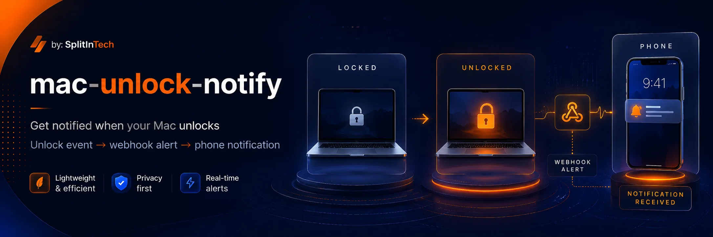

<p align="center">
  
</p>

<h1 align="center">mac-unlock-notify</h1>

<p align="center">
  <strong>Slack your iPhone when this Mac is unlocked.</strong>
</p>

<p align="center">
  <a href="https://github.com/splitintech/open-internal-tools/blob/main/mac-unlock-notify/LICENSE"></a>
  <a href="https://github.com/splitintech/open-internal-tools/tree/main/mac-unlock-notify"></a>
  <a href="https://github.com/splitintech/open-internal-tools/issues"></a>
</p>

<p align="center">
  <a href="../README.md">Hub</a>
  ·
  <a href="#getting-started">Docs</a>
  ·
  <a href="#use-cases">Use cases</a>
  ·
  <a href="#behavior">Behavior</a>
  ·
  <a href="https://www.splitin.net/careers-requests">Careers</a>
</p>

<p align="center">
  <a href="https://www.splitin.net/tech-stack/open-internal-tools/mac-unlock-notify">www.splitin.net/tech-stack/open-internal-tools/mac-unlock-notify</a>
</p>

<p align="center">
  
</p>

# A security canary for your Mac, delivered as a Slack banner on your phone

Plug-and-play on any personal Mac: clone, run `./install.sh`, paste a Slack incoming webhook. A LaunchAgent watches lock state with `ioreg` and `curl`s Slack on **locked → unlocked** only.

```text
unlock → ioreg → zsh watcher → curl → Slack webhook → iPhone banner
```

- **Unlock only**: no ping on agent start if the Mac is already unlocked.
- **Out of the box**: one installer, one webhook, one LaunchAgent.
- **Version by version**: keep improving the watcher without touching SplitIn the product.
- **Stay open, host later**: MIT package today; a hosted SplitIn product if it earns that path.

## Table of contents

- [Getting started](#getting-started)
- [Use cases](#use-cases)
- [Requirements](#requirements)
- [Slack setup](#slack-setup)
- [Install](#install)
- [Confirm it works](#confirm-it-works)
- [Uninstall](#uninstall)
- [Behavior](#behavior)
- [Security](#security)
- [Commands](#commands)
- [Careers](#careers)

## Getting started

```zsh
git clone https://github.com/splitintech/open-internal-tools.git
cd open-internal-tools/mac-unlock-notify
chmod +x install.sh uninstall.sh bin/mac-unlock-notify
./install.sh
```

This folder is the **tech part of a product** in [open-internal-tools](https://github.com/splitintech/open-internal-tools). Domain specialists own it end to end. Work in sync with other contributors and agents.

## Use cases

Ten ways developers integrate this watcher into real setups:

1. **Personal laptop canary** — Slack your phone when *this* Mac goes from locked to unlocked while you are away.
2. **Travel / hotel check** — confirm the lid was not opened overnight; one banner per unlock, with computer name and local time.
3. **Shared studio or office Mac** — know when a communal workstation is unlocked without installing a full MDM agent.
4. **CI / build Mac mini** — alert `#ops` when someone physically unlocks a dedicated builder that should stay locked.
5. **Onboarding script** — `./install.sh --webhook "$SLACK_WEBHOOK" --skip-test` in a new-hire laptop bootstrap.
6. **Incident correlation** — grep `~/Library/Logs/mac-unlock-notify.log` next to SSH or auth logs when a session looks wrong.
7. **Status bar / SketchyBar / Hammerspoon** — poll `mac-unlock-notify --status` (`locked` / `unlocked`) in a local widget.
8. **Contractor presence** — require the LaunchAgent as a lightweight “this machine was used” signal, not a keylogger.
9. **Webhook-shaped forks** — keep the `ioreg` watcher and point the `curl` at ntfy, Telegram, or Discord instead of Slack.
10. **Fleet reinstall** — re-run `./install.sh` from a fresh clone to upgrade watchers without touching SplitIn the product.

## Requirements

- macOS (tested on recent versions including Tahoe)
- Slack workspace you can add an app to
- Slack iOS app with notifications allowed
- `zsh`, `curl`, `python3`, and `ioreg` (all stock on macOS)

## Slack setup

1. Create a **private** channel, e.g. `#mac-unlock`.
2. Open [api.slack.com/apps](https://api.slack.com/apps) → **Create New App** → **From scratch**.
3. Name it `Mac Unlock`, pick your workspace.
4. **Incoming Webhooks** → On → **Add New Webhook to Workspace** → select `#mac-unlock`.
5. Copy the URL (`https://hooks.slack.com/services/…`). Treat it as a password.
6. In that channel, notify on **All messages**.
7. Slack **Preferences → Notifications → When I'm not active on desktop → Immediately, even if I'm active**.
   Without this, Slack on the Mac you just unlocked often swallows the iPhone banner. See [Slack notification settings](https://slack.com/help/articles/201355156-Configure-your-slack-notifications).
8. On iPhone: Slack notifications on; allow Slack in any Focus mode.

## Install

You will be asked for the webhook (input is hidden). The installer:

- writes `~/.config/mac-unlock-notify/env` (mode `600`)
- copies the watcher to `~/.local/libexec/mac-unlock-notify/`
- loads `~/Library/LaunchAgents/com.mac-unlock-notify.plist`
- sends one Slack test unless you pass `--skip-test`

Non-interactive:

```zsh
./install.sh --webhook 'https://hooks.slack.com/services/T…/B…/…'
./install.sh --webhook "$SLACK_WEBHOOK" --skip-test
```

The clone can be deleted after install. Re-run `./install.sh` from a fresh clone to upgrade.

## Confirm it works

```zsh
~/.local/bin/mac-unlock-notify --status    # unlocked or locked
~/.local/bin/mac-unlock-notify --test      # one Slack message
```

Then lock the Mac (`Control-Command-Q`), wait a second, unlock. You should get **one** Slack message with computer name and local time.

If `~/.local/bin` is not on your `PATH`:

```zsh
echo 'export PATH="$HOME/.local/bin:$PATH"' >> ~/.zshrc
```

Logs: `~/Library/Logs/mac-unlock-notify.log`

## Uninstall

```zsh
./uninstall.sh           # keep webhook
./uninstall.sh --purge   # also delete ~/.config/mac-unlock-notify
```

## Behavior

| Event | Slack? |
| --- | --- |
| Agent starts while already unlocked | No |
| Lid open, lock screen still up | No |
| Password / Touch ID / Apple Watch unlock | Yes |
| Fast double unlock within 5s | One message (debounced) |
| Slack HTTP error | Logged; watcher keeps running |

## Security

- The webhook is a secret. Anyone with it can post to your channel.
- It is never stored in this repo. `env.example` is a placeholder only.
- Do not commit `~/.config/mac-unlock-notify/env`.
- This is a user LaunchAgent, not a system daemon. It runs only while you are logged in.

## Commands

| Command | What it does |
| --- | --- |
| `./install.sh` | Install or reinstall for the current user |
| `./uninstall.sh` | Remove the agent and copied files |
| `mac-unlock-notify --watch` | Foreground watcher (LaunchAgent uses this) |
| `mac-unlock-notify --test` | Send one Slack message |
| `mac-unlock-notify --status` | Print `locked` or `unlocked` |

## Careers

Own this product-tech end to end — or explore SplitIn tech careers — at **[https://www.splitin.net/careers-requests](https://www.splitin.net/careers-requests)**.

<p align="center">
  
</p>

## License

MIT. See [LICENSE](LICENSE). Program rules: [CONTRIBUTING.md](../CONTRIBUTING.md).
