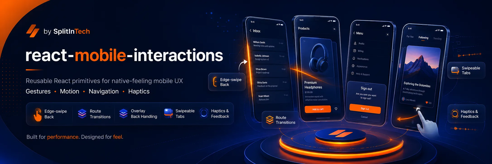
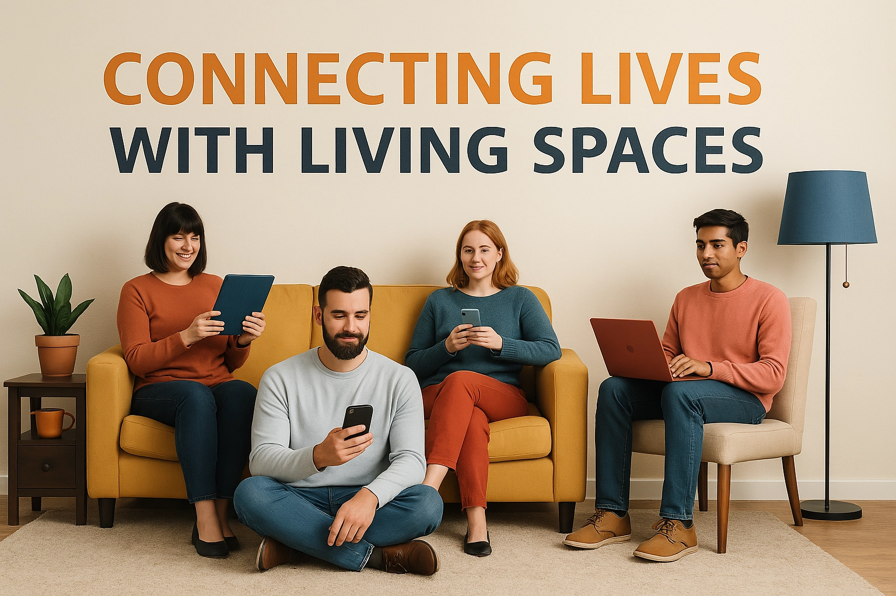

<p align="center">
  
</p>

<h1 align="center">@splitin/react-mobile-interactions</h1>

<p align="center">
  <strong>Swipe, edge-back, overlays, and native-feeling motion for React.</strong>
</p>

<p align="center">
  <a href="https://github.com/splitintech/open-internal-tools/blob/main/react-mobile-interactions/LICENSE"></a>
  <a href="https://www.npmjs.com/package/@splitin/react-mobile-interactions"></a>
  <a href="https://github.com/splitintech/open-internal-tools/tree/main/react-mobile-interactions"></a>
</p>

<p align="center">
  <a href="../README.md">Hub</a>
  ·
  <a href="#getting-started">Docs</a>
  ·
  <a href="#swipe-tabs">Swipe</a>
  ·
  <a href="#use-cases">Use cases</a>
  ·
  <a href="#overlay-back-layers">Back</a>
  ·
  <a href="https://www.splitin.net/careers-requests">Careers</a>
</p>

<p align="center">
  <a href="https://www.splitin.net/tech-stack/open-internal-tools/react-mobile-interactions">www.splitin.net/tech-stack/open-internal-tools/react-mobile-interactions</a>
</p>

<p align="center">
  
</p>

# Mobile interactions that feel native — package first, product later

Reusable React primitives for swipe gestures, edge-back navigation, overlay back layers, route transitions, and motion presets. V1 is **package-only**: install it, ship it, keep versioning it.

Built internally, open sourced so others can use the same gestures SplitIn uses. A tool specialist owns this folder end to end. It can stay MIT and later also power a hosted SplitIn experience.

- **Swipe tabs**: left forward, right back; inputs and maps ignored by default.
- **Overlay back stack**: highest priority layer wins.
- **Edge-swipe back**: router-agnostic, haptic when available.
- **Out of the box**: Framer Motion presets that respect `prefers-reduced-motion`.

## Table of contents

- [Getting started](#getting-started)
- [Use cases](#use-cases)
- [Swipe tabs](#swipe-tabs)
- [Overlay back layers](#overlay-back-layers)
- [Edge-swipe back](#edge-swipe-back)
- [Route transition](#route-transition)
- [Motion presets](#motion-presets)
- [Careers](#careers)

## Getting started

```sh
npm install @splitin/react-mobile-interactions framer-motion
```

Peer dependencies: `react`, `react-dom`, `framer-motion`.

From this hub (source only; `dist/` is gitignored):

```sh
git clone https://github.com/splitintech/open-internal-tools.git
cd open-internal-tools/react-mobile-interactions
npm install
npm run build
npm test
```

Work in sync with other contributors and agents. PRs stay in `react-mobile-interactions/`.

## Use cases

Ten ways developers integrate `@splitin/react-mobile-interactions` into a React or PWA app:

1. **Listing detail tabs** — swipe between photos, details, and activity with `useSwipeableTabs` without stealing taps from buttons.
2. **React Router edge-back** — `MobileEdgeBackHandler` + `navigate(-1)` for an iOS-style left-edge pop.
3. **Filter / sort bottom sheet** — register the sheet on the overlay back stack so Android/iOS back closes it first.
4. **Modal above sheet** — two `useMobileBackLayer` priorities; dialog wins, then the sheet.
5. **Onboarding carousel** — swipe forward/back across steps; ignore inputs so form fields still type.
6. **Inbox vs thread** — swipe between list and conversation panes in a messaging PWA.
7. **Map + list dual pane** — bind swipe on the list; maps, canvases, and iframes stay ignored by default.
8. **Checkout stepper** — swipe between cart, address, and pay; `canStart` blocks back when the flow is complete.
9. **Settings / profile routes** — wrap pages in `MobileRouteTransition` for sheet-up motion with `nativeSprings.smooth`.
10. **Accessible dialogs** — use `nativeDialogVariants` / `shouldAnimate()` so reduced-motion users skip transforms.

## Swipe tabs

```tsx
import { useSwipeableTabs } from "@splitin/react-mobile-interactions";

function MobileTabs({ tab, setTab }: { tab: "details" | "activity"; setTab: (tab: "details" | "activity") => void }) {
  const swipe = useSwipeableTabs({
    values: ["details", "activity"],
    activeValue: tab,
    onValueChange: setTab,
  });

  return <section {...swipe.bind}>...</section>;
}
```

Left swipes move forward, right swipes move backward, and interactive controls such as inputs, buttons, media, tablists, maps, iframes, and canvases are ignored by default.

## Overlay back layers

```tsx
import {
  MobileBackProvider,
  useMobileBackController,
  useMobileBackLayer,
} from "@splitin/react-mobile-interactions";

function Sheet({ open, close }: { open: boolean; close: () => void }) {
  useMobileBackLayer({
    id: "sheet",
    priority: 20,
    enabled: open,
    onBack: () => {
      close();
      return true;
    },
  });

  return open ? <div role="dialog">...</div> : null;
}

function BackButton() {
  const controller = useMobileBackController();
  return <button onClick={() => controller.triggerBack()}>Back</button>;
}

export function App() {
  return (
    <MobileBackProvider>
      <BackButton />
      <Sheet open close={() => undefined} />
    </MobileBackProvider>
  );
}
```

Layers register by `id`; the highest enabled `priority` wins. If a layer returns `false` from `onBack`, the controller continues to the next enabled layer.

## Edge-swipe back

`MobileEdgeBackHandler` is router-agnostic. Wire the back behavior in user-land:

```tsx
import { MobileEdgeBackHandler } from "@splitin/react-mobile-interactions";
import { useNavigate } from "react-router-dom";

function RouterBackGesture() {
  const navigate = useNavigate();

  return (
    <MobileEdgeBackHandler
      onBack={() => navigate(-1)}
      canStart={() => window.history.length > 1}
    />
  );
}
```

The handler listens for left-edge touch swipes, prevents native horizontal scroll when the gesture clearly becomes a back swipe, triggers haptics when available, and calls `onBack` only after a committed right swipe.

## Route transition

```tsx
import { MobileRouteTransition } from "@splitin/react-mobile-interactions";

export function MobilePage() {
  return (
    <MobileRouteTransition transitionKey="settings" direction="up">
      <main>...</main>
    </MobileRouteTransition>
  );
}
```

The default transition is a bottom sheet-up motion using `nativeSprings.smooth`. Set `active={false}` to render children directly.

## Motion presets

```tsx
import {
  nativeDialogVariants,
  nativeOverlayVariants,
  nativeSheetVariants,
  nativeSprings,
  shouldAnimate,
} from "@splitin/react-mobile-interactions";
```

`shouldAnimate()` reads `prefers-reduced-motion` at runtime. Components should call it when deciding whether to apply motion-sensitive transforms.

## Careers

Own this package end to end — or explore SplitIn tech careers — at **[https://www.splitin.net/careers-requests](https://www.splitin.net/careers-requests)**.

<p align="center">
  
</p>

## License

MIT. Free to use in personal, open-source, and commercial applications. See [LICENSE](LICENSE). Program rules: [CONTRIBUTING.md](../CONTRIBUTING.md).
